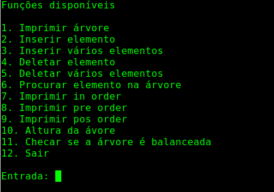
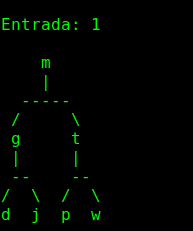
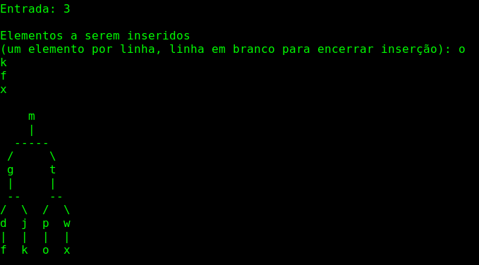

# Binary Search Tree

**Disciplina**: FGA0210 - PARADIGMAS DE PROGRAMAÇÃO - T01 <br>
**Nro do Grupo**: 3<br>
**Paradigma**: Funcional<br>

## Alunos
|Matrícula | Aluno |
| -- | -- |
| 17/0013651  |  João Gabriel Antunes |
| 17/0163571  |  Murilo Loiola Dantas |

## Sobre 
O projeto fornece uma série de funções de árvores binárias de busca. As funções podem ser testadas facilmente através de um menu interativo.

## Screenshots
### Menu



### Árvore base



### Árvore após inserção múltipla



## Instalação 
**Linguagens**: Haskell<br>
**Tecnologias**: Cabal<br>
Para instalar as dependências, será necessário ter o gerenciador de pacotes Cabal instalado. Para verificar se ele já está instalado, utilize o comando ```cabal --version```. Caso não esteja instalado, siga as instruções [aqui](https://cabal.readthedocs.io/en/3.4/getting-started.html).</br>
Na sequência, execute os comandos ```cabal update``` e ```cabal install pretty-tree```, nesta ordem.</br>
Por último, compile o projeto com o comando ```ghc Main.hs -o main``` e execute o output com ```./main```.

## Vídeo
O vídeo pode ser encontrado na pasta **assets/video.mp4**.

## Outros 
- A árvore base utilizada como exemplo é *hard-coded* e imutável. Após cada comando, ela volta ao formato base.

## Fontes
[Learn You a Haskell For Greater Good!](http://learnyouahaskell.com/chapters)
